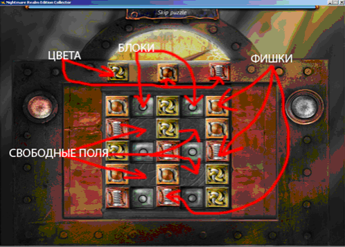
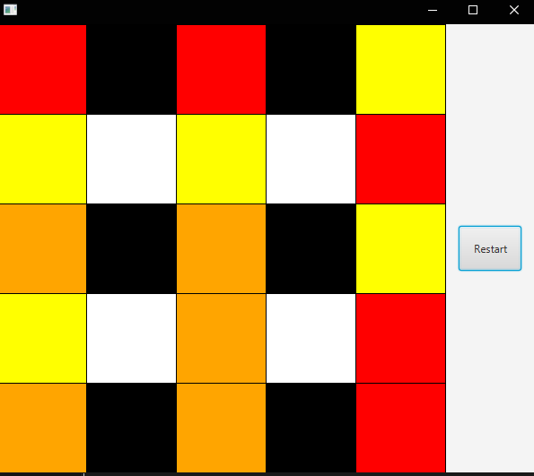

# Nightmare Realm

Nightmare Realm Prototype - тестовое задание в WarGaming Academy 2021.

Требуется написать прототип реальной миниигры из нашего вышедшего проекта
[Nightmare Realm](https://www.bigfishgames.com/games/6705/nightmare-realm-collectors-edition/?pc). Жестких требований к инструментарию и технологиям нет.

Скриншот оригинальной игры:



Скриншот прототипа:



## Механика игры

Дано поле 5*5 клеток и 15 фишек трех цветов, по пять каждого цвета. Каждая клетка поля
может быть либо блокирована, либо занята одной фишкой любого цвета, либо свободна.
На поле выставлены все фишки, 6 клеток блокированы и 4 клетки свободны.
Блокированные клетки остаются таковыми всегда. Фишки мы можем передвигать на
соседнее свободное место по горизонтали или вертикали. Требуется, передвигая фишки,
выставить их в три вертикальных ряда соответственно цветам, стоящим над полем.

## Запуск

### Через консоль:

- Убедитесь, что вы находитесь в корневом каталоге
- Запустите `Main` в `Main.java`, набрав:

```bash
mvn clean javafx:run
```

- В качестве альтернативы вы можете запустить `Main` в `Main.java` в
  выбранной вами среде разработки, например IntelliJ

### Также можно запустить [Executable jar file](NightmareRealmPrototype.jar)


